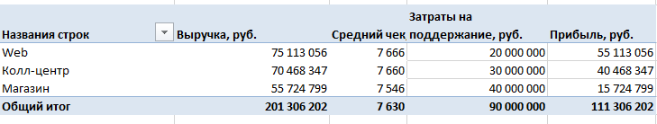
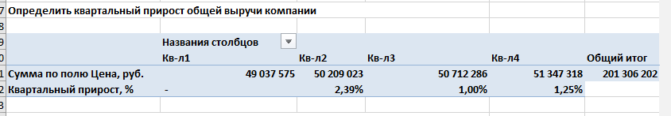
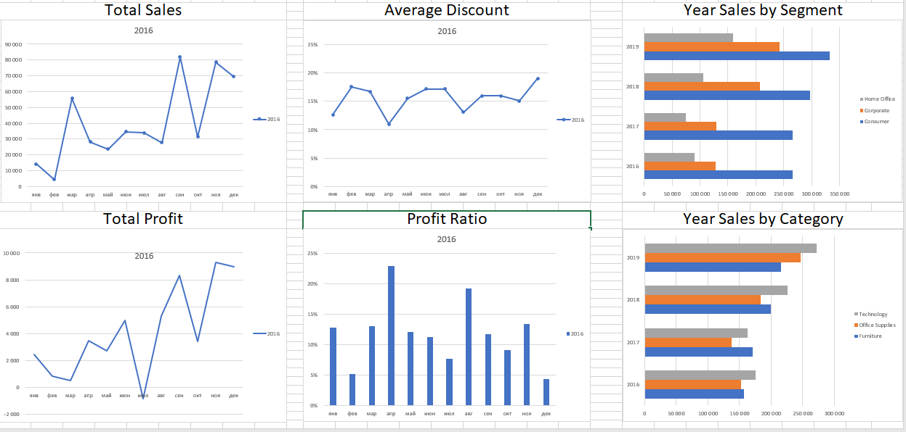

# Задание 1. Дополнить [excel_file](./excel/блок_2_Алексеев_КВ.xlsx).

- Выручка, прибыль, средний чек

- Прирост прибыли по кварталам

# Задание 2.

> Сделай выводы о том, насколько успешна деятельность компании. Требуется ли изменить подход к ведению бизнеса?

Развитие бизнеса идёт хорошо. Есть значительная прибыль. Затраты окупаются. В течение всего есть рост, однако к концу года он замедлился. Необходимо проанализировать почему так произошло. Необходимо уделить повышенное внимание магазину. Есть гипотеза что люди приходят в магазин, общаются с продавцами, а потом покупают через Web и Колл-центр, так как могут дома принять комфортное решение без очередной поездки в магазин. 

# Задание 3.

Составьте один максимально красивый и понятный слайд из аналитических данных, которые были получены в результате выполнения всех пунктов.

[Слайд](Слайд.pdf)

# Задание для модуля 1

## Архитектура решения

## Аналитика в excel

> Подробнее в [файле](./excel/Блок_1_superstore_Алексеев_КВ.xlsx)

