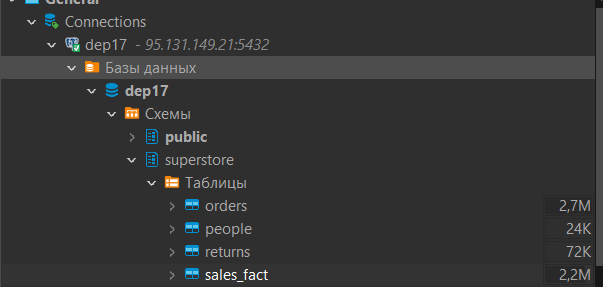

# 1. Установить Postgres базу данных на компьютер. Инструкции по установки Postgres.

Для запуска Postgres будем использовать `docker-compose.yml` файл. 
Необходимо выполнить команду `docker-compose up`

# 2. Установить клиент SQL для подключения базы данных. Инструкции по установки DBeaver . Так же вы можете использовать любой другой клиент для подключения к ваше БД.

Для подключения к БД будем использовать dbeaver.


# 3. Создать 3 таблицы и загрузите данные из Superstore Excel файл  в базу данных. Сохраните в GitHub скрипт загрузки данных и создания таблиц. Вы можете использовать готовый пример sql файлов .

Для создания схемы и таблиц необходимо по очереди выполнить скрипты, лежащие в директории `./sql_queries`, но с учетом того, что сама БД развернута внутри Докер контейнера.

```bash
cat ./sql_queries/create_schema.sql | docker exec -i postgres psql -U admin -d test_db
```
```bash
cat ./sql_queries/create_people.sql | docker exec -i postgres psql -U admin -d test_db
```
```bash
cat ./sql_queries/create_returns.sql | docker exec -i postgres psql -U admin -d test_db
```
```bash
cat ./sql_queries/create_orders.sql | docker exec -i postgres psql -U admin -d test_db
```

Либо можно использовать скрипт `create_schema_and_tables.sh`, который сделает то же самое.

Получившиемся таблицы:


# 4. Напишите запросы, чтобы ответить на вопросы из Модуля 01 . Сохраните в вашем GitHub скрипт загрузки данных и создания таблиц.
Запросы лежат в директории [analytics_sql](./analytics_sql/overview_dashboard.sql)

# 5. Нарисовать модель данных для файла Superstore : 
## Концептуальную


## Логическую.


## Физическую.


# 6. Скопировать DDL и выполнить его в SQL-клиенте.

DDL скрипты по созданию таблиц находятся в директории [ddl_scripts](./ddl_scripts)

Подключение к БД 95.131.149.21:5432/dep17 прошло успешно


Таблицы добавлены в БД 

