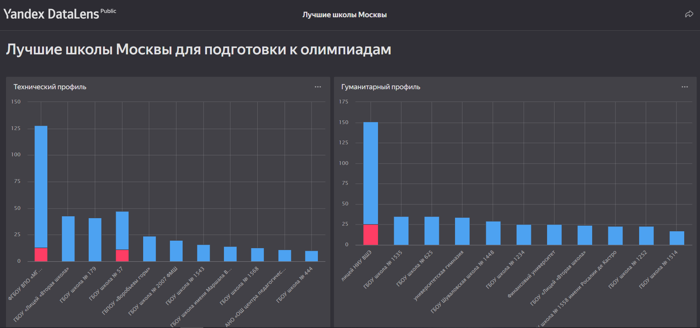
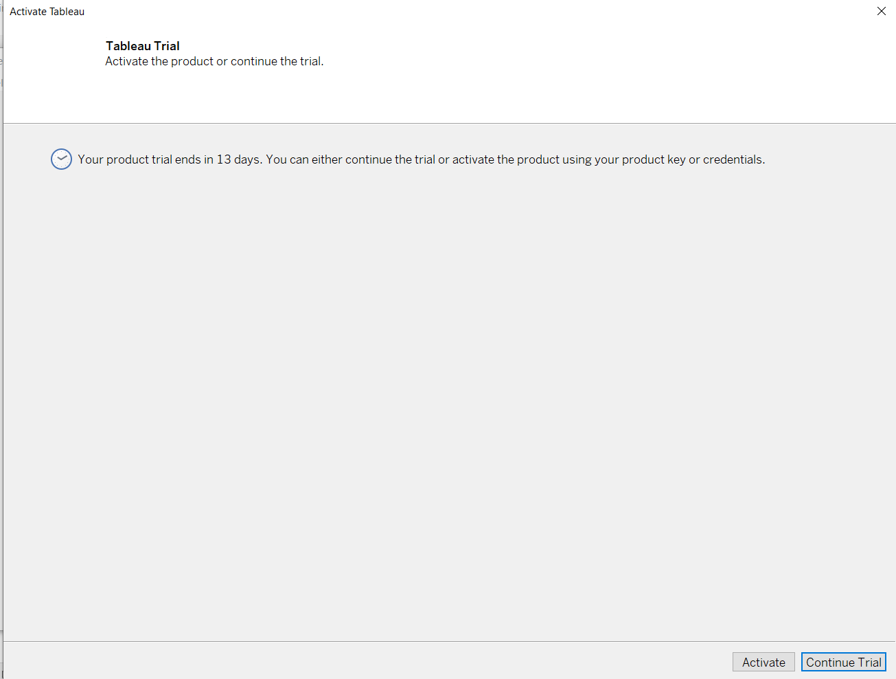
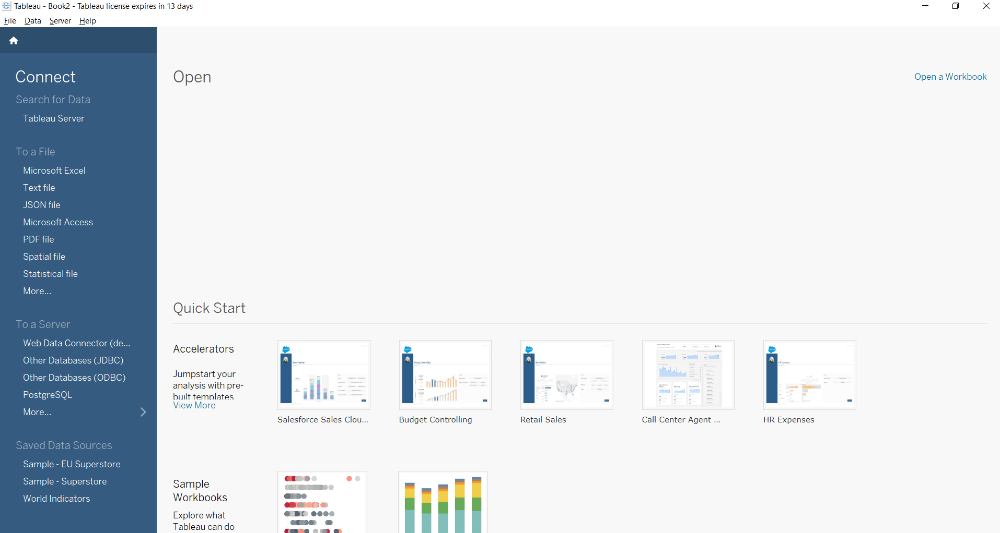
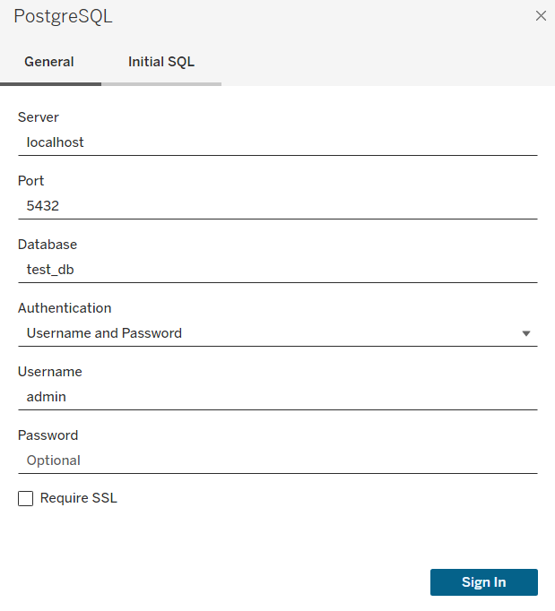
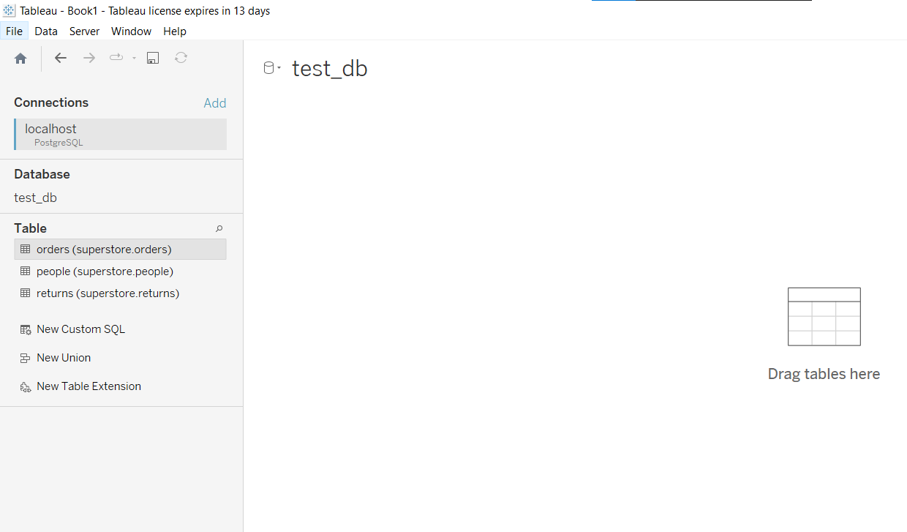
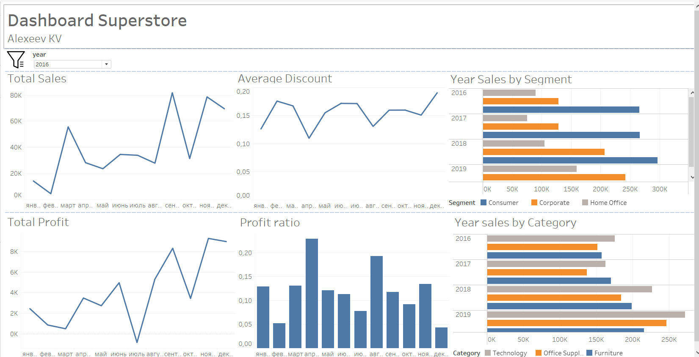

# Лабораторная работа 3.1

# 1. Реализовать дашборд для датасета `moscow schools - winners` (Вариант 1).
Для создания датасета использовать DataLens по [обучению](https://yandex.cloud/ru/docs/datalens/tutorials/data-from-csv-visualization)

Визуализация лучших школ Москвы по профилям по числу призеров и победителей олимпиад. [Ссылка](https://datalens.yandex/kq579x6u07848)

# 2. Установить Tableu  Desktop

Использовать [инструкцию](https://github.com/BosenkoTM/Data-Engineering-Platforms/blob/master/how-to/how-to-tabelau-desktop.md#how-to-%D0%BA%D0%B0%D0%BA-%D1%83%D1%81%D1%82%D0%B0%D0%BD%D0%BE%D0%B2%D0%B8%D1%82%D1%8C-tableau-desktop). Необходимо установить VPN.

Установка прошла успешно. 

# 3. Подключившись к БД Postgres нарисовать дашборд для ЛР1/2

Для подключения к БД Postgres (которая в ЛР2 была развернута в контейнере) необходимо сначала скачать драйвер и потом установить подключение:

После установки соединения можно подключаться к БД и использовать эти данные для построение дашборда.

# 4. Создать дашборд на [Tableu Public](https://public.tableau.com/app/discover). (Нужен VPN!)

[Ссылка](https://public.tableau.com/app/profile/konstantin.alekseev/viz/DashboardSuperstore_17132085944750/Dashboard1) на созданный дашборд на Tableu Public

# P.S. 
Установить tableu server и поработать с ним у меня не получилось. Современные версии требуют 16 гб оперативы. А версию от 2018 года мне не удалось найти...