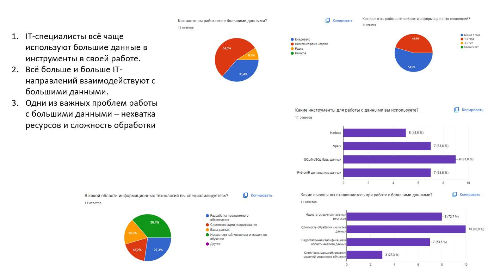

# лабораторная работа 3.2

# 1. Создать опрос.

[Опрос](IT_survey.pdf)

# 2. Визуализировать результаты

Опрос прошло 11 человек, в основном это мои бывшие одноклассники и бывшие одногруппники из бакалавриата, которые работают в IT.

