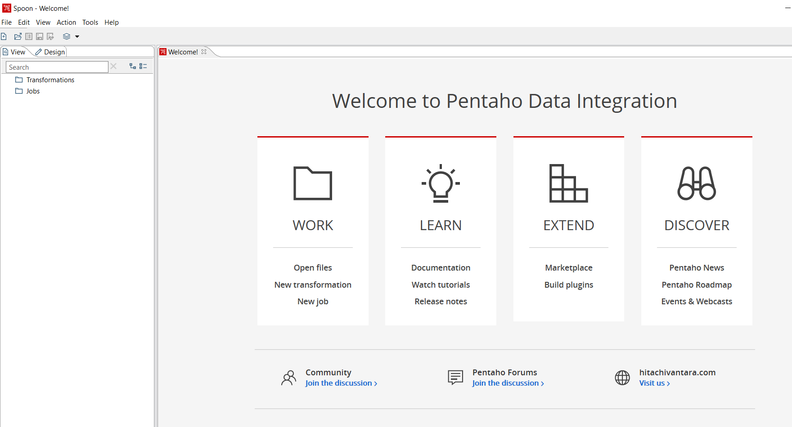
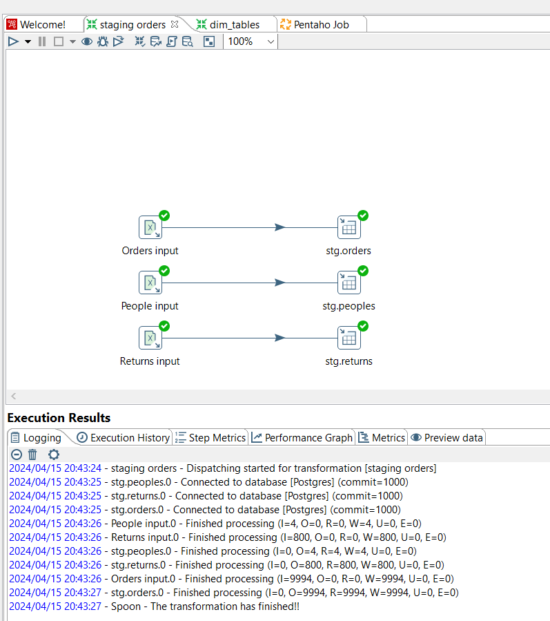
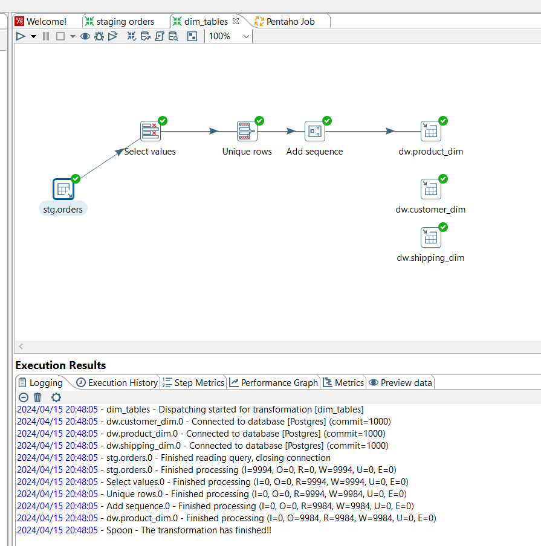
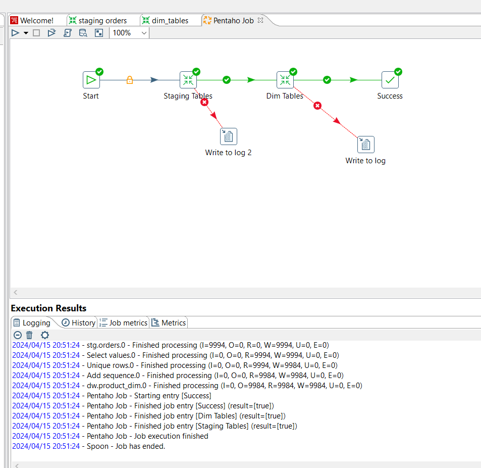
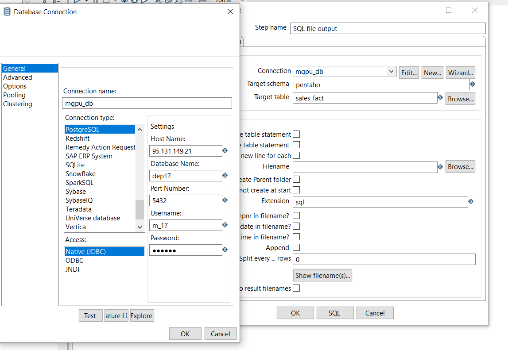
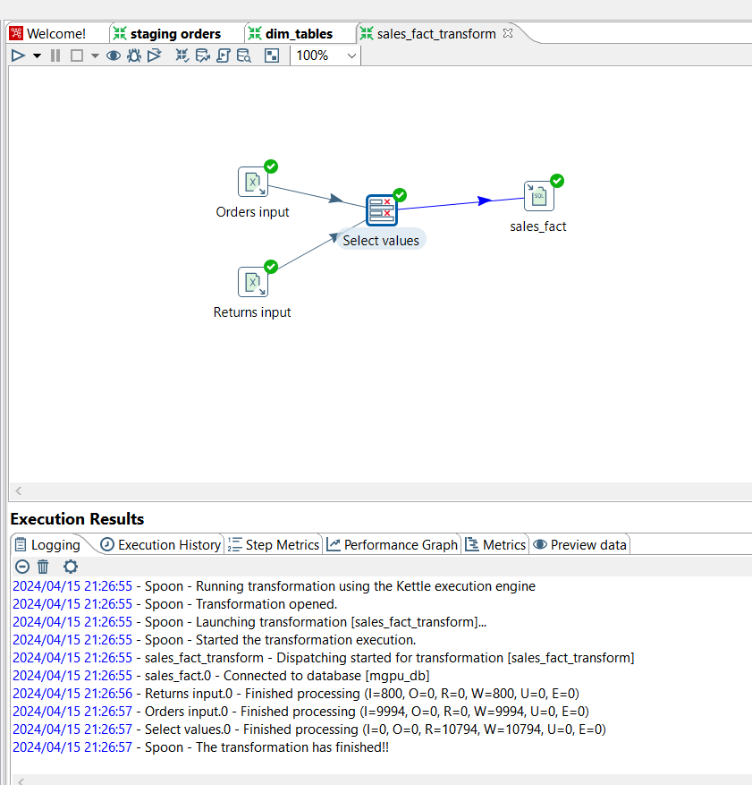
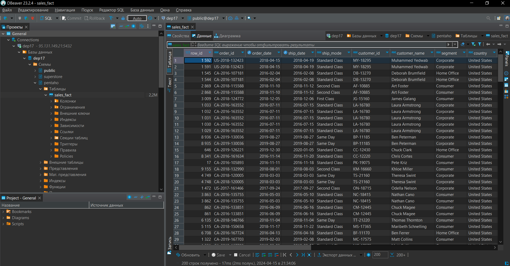

# Лабораторная работа 4.1

# 1. Установить Pentaho DI

Установка прошла успешно согласно видео.

# 2. Запустить примеры 

# 3. Создать трансформацию для `sales_fact`

Сначала установим подключение к БД МГПУ:

Потом создадим и запустим трансформацию

Посмотрим на результат в DBeaver

# 4. Выявить 8-10 подсистем в ETL Pentaho DI

1. Table input 
2. Excel/textfile input
3. Select values
4. Add sequence
5. Sort rows
6. Merge join
7. Join rows
8. Table output