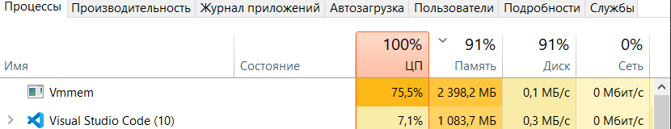

# Fancy ETL - airflow 

Для того, чтобы развернуть у себя Apache Airflow будем использорвать `docker-compose`, который взяли с их [сайта](https://airflow.apache.org/docs/apache-airflow/2.9.0/docker-compose.yaml).

Внутри `docker-compose` мы поменяли некоторые значения, например изменили расположение volume, создав для этого директорию airflow_volume. Также изменили значение переменной `AIRFLOW__CORE__LOAD_EXAMPLES` на `false`, чтобы по дефолту не появилось миллион дагов с примера. 

Сами даги хранятся в директории `airflow_volume/dags`, которая является вольюмом.

После успешного запуска 


```bash

docker-compose up -d
```

Проверим, что все сервисы успешно поднялись.


Можем перейти по localhost:8080

и увидеть, что можно войти по логину/пароля airflow/airflow


где можно увидеть наш даг hello_world


Перейдем в него и запустим.


К сожалению, 8 ГБ оперативной памяти совершенно не хватает для каких-либо серьезных задач, потому что уже при дагом простом даге, система максимально перегружена.

